# Retro Web UI

[日本語](README.ja.md)

[](https://github.com/ririri-rgb/retro-web-ui/actions/workflows/ci.yml)
[](https://github.com/ririri-rgb/retro-web-ui/releases/latest)
[](LICENSE)

An open-source desktop application, deterministic CLI, and Codex Skill that convert an existing web application's interface into one of four desktop-era styles while preserving the application's behavior.

- Windows 98
- Windows XP
- Windows 7
- Japanese Freeware 2000s

## Desktop GUI

The Windows XP-style PySide6 desktop application is a safe orchestration layer.
It lets a user select a repository/application and theme, inspect deterministic
analysis, start a bidirectional Codex App Server session with the user's own
ChatGPT sign-in, answer approval requests, interrupt/reconnect, and review
verification, Git diff, and Before/After evidence. It does not ask for or store
an OpenAI API key, and it does not replace the Core/CLI/Skill conversion logic.

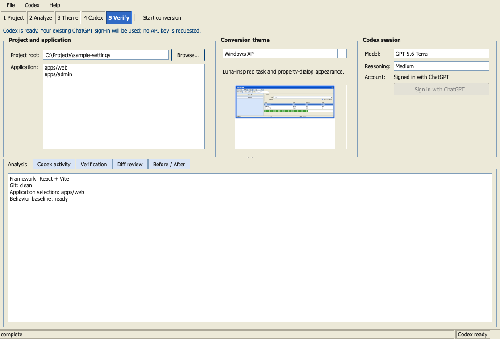

Download the native archive for macOS, Windows, or Linux from the
[v2.0.0 release](https://github.com/ririri-rgb/retro-web-ui/releases/tag/v2.0.0).
Python and Qt are included; Codex remains an external prerequisite. The macOS
archive is ad-hoc signed but not notarized, the Windows archive is unsigned, and
the Linux archive requires a conventional desktop display stack plus `libEGL`.
Verify the adjacent SHA-256 file before opening an unsigned package.

Run from a source checkout instead:

```bash
python3 -m venv .venv-gui
.venv-gui/bin/python -m pip install '.[gui]'
.venv-gui/bin/retro-web-ui-gui
```

On Windows, use `.venv-gui\Scripts\retro-web-ui-gui.exe`. Codex must already be
installed and signed in with ChatGPT; the GUI starts `codex app-server` locally
over stdio and never asks for an API key. Published `v1.1.0` remains the
immutable pre-GUI CLI + Skill baseline. See the [desktop architecture](docs/gui-architecture.md)
and [v2 engineering evidence](docs/gui-validation-report.md).

This is not a color preset and not a component library tied to React. The CLI makes repeatable inspection, behavior signals, theme assets, diagnostics, and verification evidence machine-readable. The Skill uses that evidence to choose a framework-aware integration strategy, map modern UI structures to desktop-era semantics, and perform the contextual/runtime/visual review that a deterministic tool cannot safely replace.

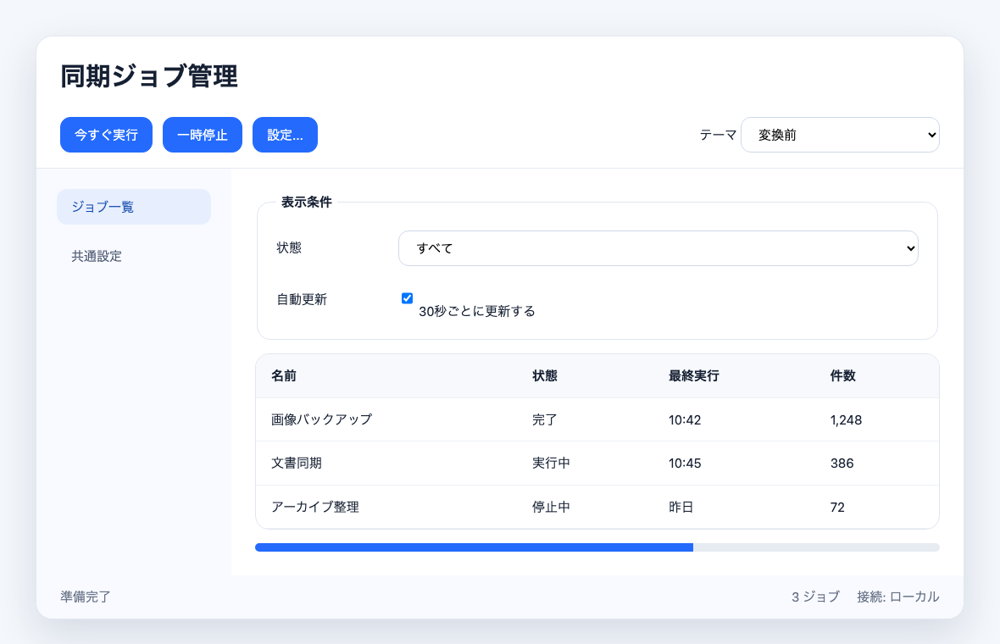

| Windows 98 | Windows XP |
| --- | --- |
| 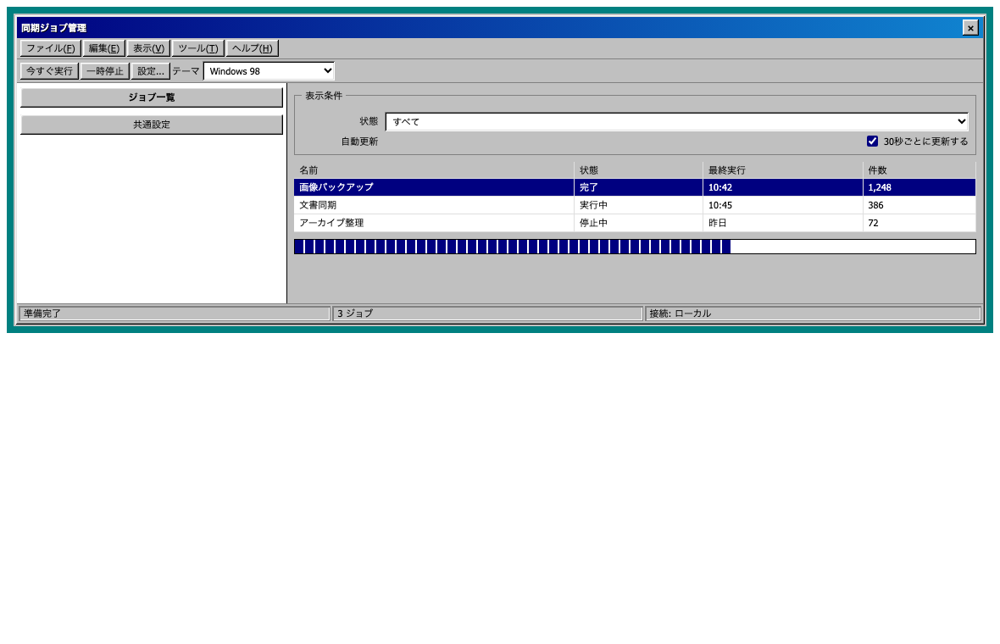 | 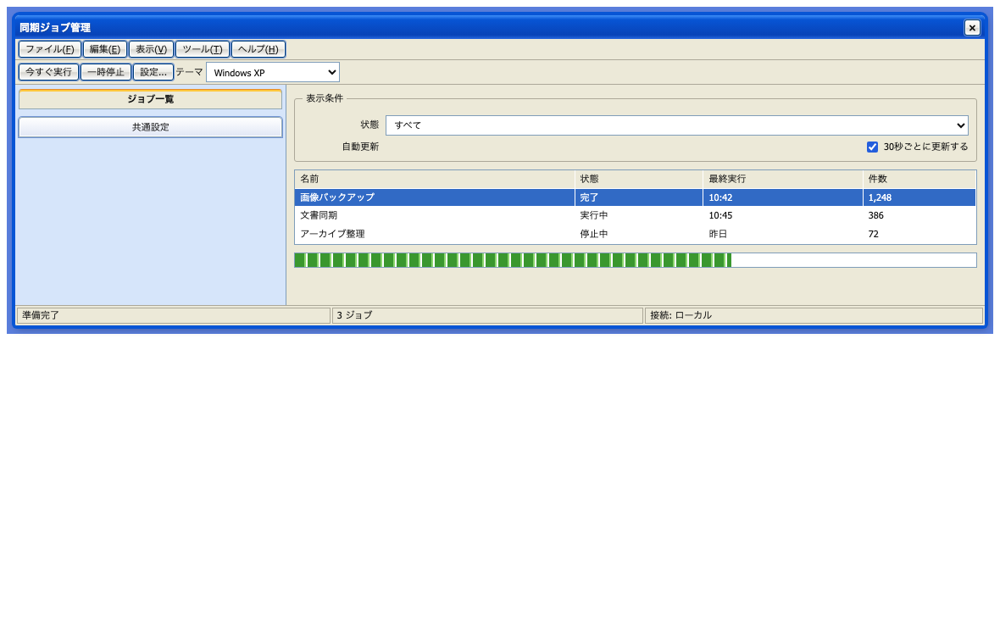 |

| Windows 7 | Japanese Freeware 2000s |
| --- | --- |
| 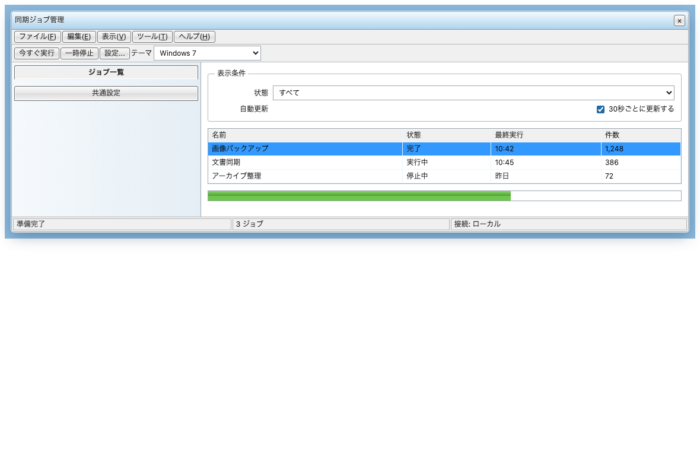 | 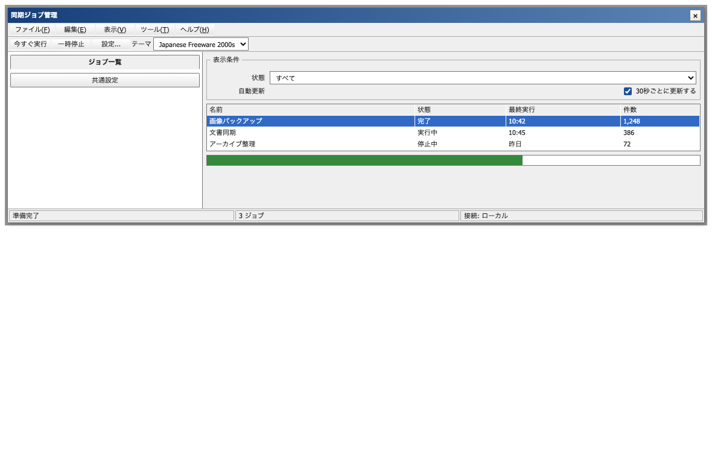 |

The screenshots use the same HTML and JavaScript. Only the theme root and CSS change. They demonstrate the bundled primitives; a real conversion also restructures cards, navigation, dialogs, and feedback according to meaning.

Two structurally different conversion checks exercise that semantic step:

| TodoMVC Vanilla ES6 → Windows 98 | React/Vite → Japanese Freeware 2000s |
| --- | --- |
| 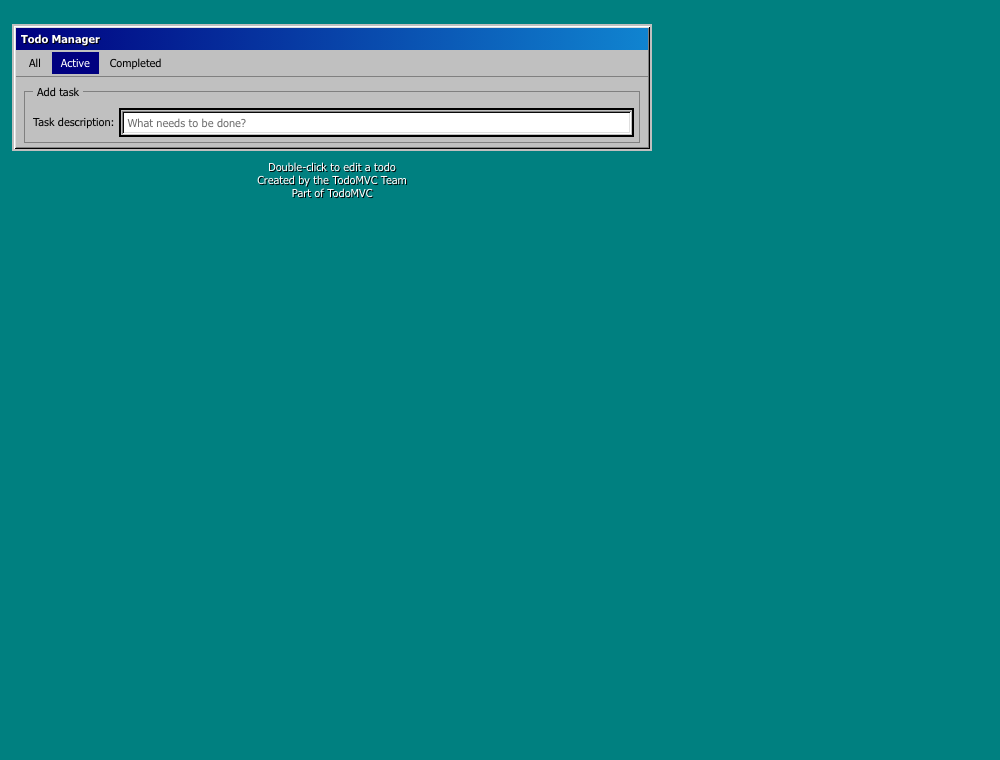 | 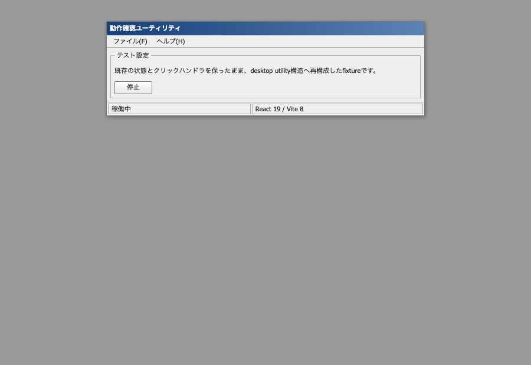 |

The TodoMVC result is from a pinned MIT-licensed upstream checkout used temporarily for validation; the repository stores only the screenshot and evidence, not a vendored copy. The React result is the repository's production-built interaction fixture.

Current main also exercises component-library and rendering-model boundaries in production builds:

| React/MUI/Emotion → Windows 98 | Vue/Bootstrap → Windows XP |
| --- | --- |
| 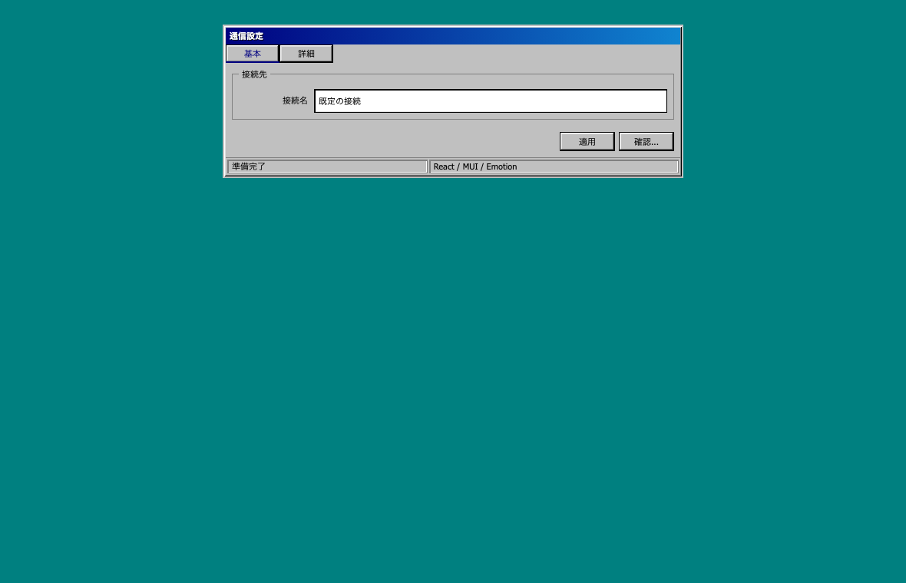 | 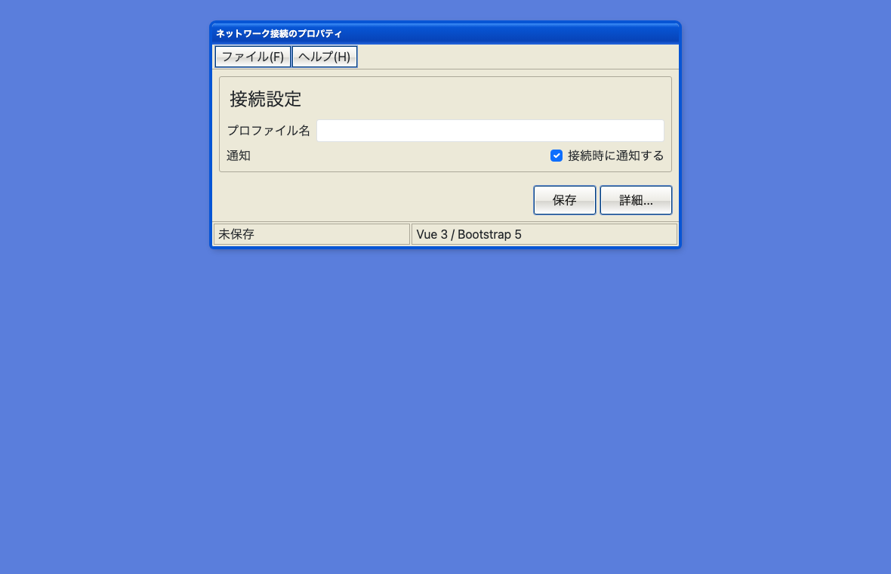 |

| Next SSR/Radix/Tailwind → Windows 7 | SvelteKit hydration → Japanese Freeware 2000s |
| --- | --- |
| 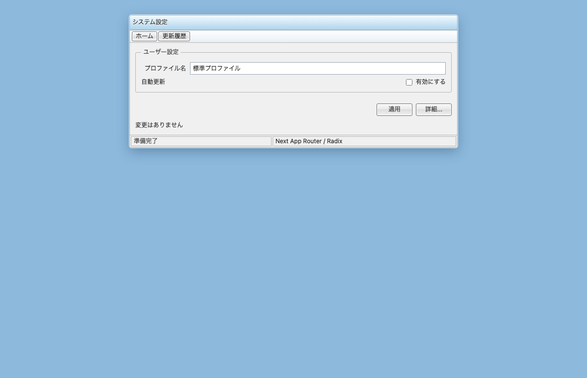 | 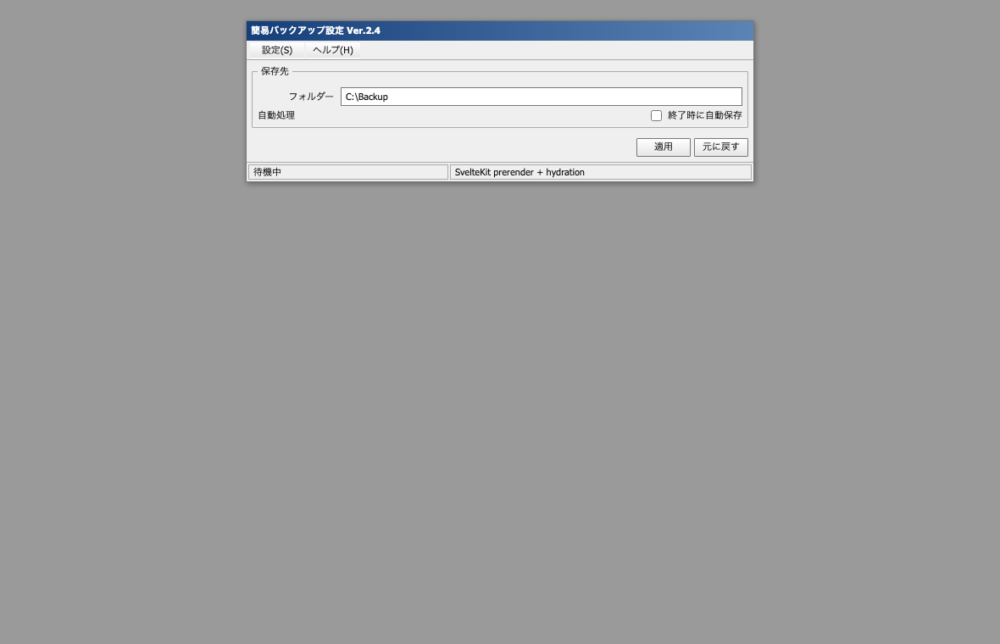 |

The tests verify more than screenshots: controlled state, forms/live regions, initial server HTML, hydration, library lifecycle events, portal theme scope, Escape closing, focus return, and targeted computed styles. These are bounded fixtures, not claims that every component in each ecosystem is supported.

A second real-OSS case records a 2026-08-27 manual conversion of the authentication surface of pinned MIT-licensed `naive-ui-admin`: it performs the demo login, follows its real Vue Router transition, and confirms that temporary portal-host theming does not leak into the unconverted dashboard. This heavy checkout is not rerun in CI.

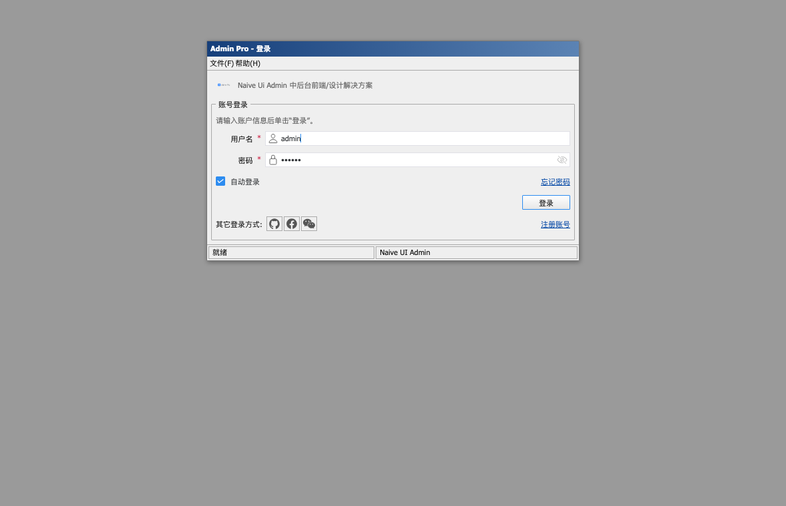

## Install

Ask Codex's `$skill-installer` to install the versioned Skill directory from GitHub:

```text
$skill-installer install https://github.com/ririri-rgb/retro-web-ui/tree/v2.0.0/skills/retro-web-ui
```

Or clone the tagged release and copy the Skill into the current user location:

```bash
git clone --branch v2.0.0 --depth 1 https://github.com/ririri-rgb/retro-web-ui.git
mkdir -p "$HOME/.agents/skills"
cp -R retro-web-ui/skills/retro-web-ui "$HOME/.agents/skills/"
```

For a repository-scoped installation, copy it to the repository's `.agents/skills/retro-web-ui/` directory. Codex also follows symlinked Skill folders. Restart or reload the Codex session if an update does not appear. The core Skill and helper scripts require Python 3.9+ and no third-party Python packages. Visual verification requires an installed Chrome/Chromium-compatible browser only when screenshots are requested. The repository's cross-framework regression harness additionally requires Node.js 22+ for its dependency-free external browser driver.

Version `2.0.0` is the current desktop + CLI + Skill release. It retains the standalone Skill layout, installable deterministic CLI, and the `v1.0.0` legacy helper entry points.

### Install the CLI from a checkout

The CLI has no third-party runtime dependency. Install the current checkout into an isolated environment:

```bash
python3 -m venv .venv
.venv/bin/python -m pip install .
.venv/bin/retro-web-ui info --json
```

On Windows, use `.venv\Scripts\python` and `.venv\Scripts\retro-web-ui`. A release wheel and source distribution are built from the same Skill source tree and contain the matching manifest, theme assets, instructions, and shared core. Codex discovery still requires the Skill installation above; installing the CLI alone does not copy it into `.agents/skills`.

## Use from Codex

Invoke it explicitly or describe the target style naturally:

```text
Use $retro-web-ui to convert this app to Windows 98 style without changing its behavior.
```

```text
このアプリを2000年代の日本製Windowsフリーソフト風にして。API、ルーティング、フォームの挙動は維持して。
```

The Skill supports these canonical theme IDs:

| Theme | UI language |
| --- | --- |
| `windows-98` | hard raised/sunken edges, compact property sheets, menus, list views, status segments |
| `windows-xp` | Luna-like themed states, blue window chrome, task/property panes, slightly increased spacing |
| `windows-7` | restrained Aero-era frame, command bar/link patterns, thin borders, Explorer/control-panel hierarchy |
| `japanese-freeware-2000s` | dense Japanese utility layout, toolbars, detailed settings, split/list/log panes, conventional command rows |

## How it preserves behavior

The Skill treats API calls, authentication, routes, state transitions, event handlers, form contracts, validation, persistence, data formats, accessibility state, and test selectors as protected. It prefers scoped CSS and additive markup. Structural changes are made only when needed for semantic fidelity.

The unified CLI reduces avoidable repeated reasoning and gives Codex one versioned JSON contract:

```bash
python3 -m venv .venv
.venv/bin/python skills/retro-web-ui/scripts/retro_web_ui.py info --json
.venv/bin/python skills/retro-web-ui/scripts/retro_web_ui.py analyze /path/to/app --json
.venv/bin/python skills/retro-web-ui/scripts/retro_web_ui.py behavior snapshot /path/to/app --output /tmp/before.json --json
.venv/bin/python skills/retro-web-ui/scripts/retro_web_ui.py verify /path/to/app --theme windows-7 --baseline /tmp/before.json --json
```

On Windows, use `.venv\\Scripts\\python` for the interpreter path.

The guard stores hashes and counts rather than source excerpts or literal values. It catches many changed event, request, route, storage, form, and framework bindings, but it does not prove semantic equivalence. Existing tests and runtime interaction checks remain required. Exit `1` means review is required, `2` is invalid input or a refused unsafe write, and `3` is a schema/version mismatch.

Generate a namespaced starter bundle:

```bash
.venv/bin/python skills/retro-web-ui/scripts/retro_web_ui.py theme bundle windows-7 --output src/retro-web-ui.css --json
```

Then put the matching `data-retro-theme` on an application root and adapt the markup deliberately. The generator does not mass-rewrite source and refuses to replace a different existing file unless `--force` is passed after review.

## CLI capabilities and boundary

| Command | Deterministic capability | Writes target files? |
| --- | --- | --- |
| `info` | CLI/Skill/behavior/theme contract compatibility | No |
| `analyze` | project/app candidates, framework/style/rendering/risk evidence, verification argv | No |
| `doctor` | Python, Git, package-manager, app-selection, and manifest diagnostics | No |
| `behavior snapshot` / `compare` | explicit hashed baseline artifact and protected-signal comparison | Snapshot only |
| `theme list` / `bundle` | theme IDs, digests, and deterministic namespaced CSS | Bundle only with `--output` |
| `audit` | static modern-style residue and integration heuristics | No |
| `verify` | read-only aggregation of analysis, doctor, audit, and behavior evidence | No |

`--json` emits one envelope with stable `schema_version`, tool/API version, command, status, result, diagnostics, and read-only metadata. Monorepos with several plausible frontend applications return `APP_SELECTION_REQUIRED` until `--app` is explicit. The CLI never installs dependencies, silently runs inferred project scripts, or performs semantic conversion. See the [CLI contract](skills/retro-web-ui/references/cli.md) and [boundary rationale](docs/cli-boundary.md).

## Compatibility

Claims below reflect tests in this repository, not theoretical support.

| Application shape | Evidence | Status |
| --- | --- | --- |
| Static HTML + Vanilla JS | detector, behavior baseline/compare, real Chrome interactions, all four rendered themes | Verified |
| TodoMVC `javascript-es6` real OSS | pinned MIT checkout, semantic markup conversion, original/themed build, identical JS bundle, behavior guard, hash routes, visual inspection | Semantic Windows 98 conversion verified; upstream todo-add baseline failure remains |
| React 19 + Vite 8 + Tailwind 4 | locked production build, semantic Japanese freeware conversion, unchanged handler/state signals, real click smoke | Converted build and interaction verified; broader React ecosystems remain conditional |
| React 19 + MUI 9 + Emotion | production build, controlled input, real portal dialog, Escape/focus return, final DOM/computed style | Semantic Windows 98 fixture verified; selected controls only |
| Vue 3 SFC + Vite 8 + Bootstrap 5 | production build, `v-model`, validation/form flow, actual Bootstrap modal lifecycle, computed style, screenshot | Semantic Windows XP fixture verified |
| SvelteKit 2 + Svelte 5 | static prerender production build followed by real hydration, bindings/form/live status, screenshot | Semantic Japanese freeware fixture verified; request SSR untested |
| Next.js 16 App Router + Tailwind 4 + Radix Dialog | request-time SSR HTML, client-island hydration, controlled form, portal/Escape/focus, desktop/dialog/narrow screenshots | Semantic Windows 7 fixture verified |
| `naive-ui-admin` real OSS login | pinned MIT checkout, build, Naive UI/Pinia/router flow, real demo login, route/theme cleanup, normal/narrow visual review | Dated manual authentication-surface record; not CI, dashboard not converted |
| Nuxt, Angular, Astro, other CSS-in-JS and complex libraries | detector or documented scoped fallback only | Best-effort until tested in the target project |

See [Compatibility evidence](docs/compatibility.md) for exact coverage, the [v1 Validation report](docs/validation-report.md), the [Final validation report](docs/final-validation-report.md) supporting v1.0.0, and the [CLI + Skill validation report](docs/cli-validation-report.md) supporting v1.1.0.

## Known limitations and unsupported cases

- A safe general-purpose script cannot infer every card-to-group-box or sidebar-to-property-sheet mapping. Codex performs those meaning-dependent edits.
- The CLI is not an automatic converter. Runtime behavior, target-native command selection, application-specific CSS/portal/SSR repair, accessibility review, and visual fidelity remain Skill responsibilities.
- Closed Shadow DOM, canvas/WebGL-only interfaces, cross-origin iframe contents, binary/generated bundles without source, and native desktop apps cannot be safely transformed by this Skill.
- Portals, virtualized lists, generated class names, CSS-in-JS specificity, Bootstrap data bindings, and SSR hydration always need target-specific runtime verification even where one representative fixture now passes.
- The static audit uses heuristics and can report false positives. A clean audit is not visual proof.
- The static audit excludes dependency and generated directories; dependency CSS can retain modern styling, so computed-style/screenshot inspection is mandatory.
- The CSS kit intentionally does not reproduce proprietary Windows icons, fonts, wallpapers, sounds, or extracted system bitmaps.
- Responsive behavior is preserved where practical, but a fixed-window visual composition may need target-specific narrow-screen compromises.
- Native packages are not Developer ID-notarized or Authenticode-signed in v2.0.0, and there is no auto-updater. Verify checksums and use the operating system's explicit local-app approval flow.
- The GUI does not infer or install a target application's browser/runtime. Before/After capture remains explicit evidence from an authorized existing runtime.

## Verification

Create the repository-local virtual environment, install the locked JavaScript fixture graph, then run the full gates:

```bash
python3 -m venv .venv
npm ci
npm run build:fixtures
npm audit --omit=dev --audit-level=moderate
.venv/bin/python -m unittest discover -s tests -v
.venv/bin/python scripts/quick_validate_compat.py skills/retro-web-ui
.venv/bin/python -m pip install "setuptools>=69" "build>=1.2,<2"
.venv/bin/python scripts/package_cli.py --output /tmp/retro-cli-a
.venv/bin/python scripts/package_cli.py --output /tmp/retro-cli-b
.venv/bin/python tests/package_smoke.py /tmp/retro-cli-a --compare /tmp/retro-cli-b
.venv/bin/python tests/visual_smoke.py --check-only
.venv/bin/python tests/runtime_smoke.py --check-only
```

The Python unit/Skill helpers have no third-party runtime dependency. `npm ci` installs only the locked framework validation harness. The runtime smoke combines in-app assertions with an external dependency-free Chrome DevTools Protocol driver and fails on browser warnings/errors. CI generates and uploads current browser renders for review. Generate the seven showcase screenshots locally when shared theme CSS changes:

`npm audit --omit=dev --audit-level=moderate` reports zero production vulnerabilities. The full development-tree audit currently reports low-severity [GHSA-pxg6-pf52-xh8x](https://github.com/advisories/GHSA-pxg6-pf52-xh8x) through SvelteKit's `cookie@0.6.0`; npm offers no non-breaking resolution for the locked SvelteKit line. This fixture-only dependency is not included in the Skill ZIP, wheel, or source distribution.

```bash
.venv/bin/python tests/visual_smoke.py
```

When using the Skill on another app, also run that app's existing build, typecheck, lint, tests, and representative interactive flows. Review `git diff`, `git diff --check`, the behavior guard report, browser console output, focus order, keyboard access, clipping, overflow, and screenshots.

## Repository layout

```text
skills/retro-web-ui/
  SKILL.md                 agent-facing workflow and routing
  manifest.json            Skill/CLI/behavior/theme compatibility contract
  __init__.py, core/       installable shared Python API
  agents/openai.yaml       Codex UI metadata
  references/              behavior, framework, licensing, mapping, and theme guidance
  scripts/                 unified CLI plus backward-compatible deterministic helpers
  assets/theme-kit/        original namespaced CSS primitives and four themes
  assets/showcase/         same-behavior visual example
tests/                     unit, fixture, and browser smoke tests
docs/                      research, architecture, evidence, and validation records
screenshots/               generated Before/After documentation images
scripts/package_cli.py     reproducible wheel/sdist builder
retro_web_ui_gui/          PySide6 desktop controller, widgets, and CodexBridge
scripts/build_native.py    host-native build, smoke, notices, and archive gate
```

## Licensing and trademarks

Project code and original CSS are licensed under the [MIT License](LICENSE). No proprietary Windows assets are used. Native archives include Qt/PySide and CPython under their own licenses with component inventories and corresponding notices; see [Third-party notices](THIRD_PARTY_NOTICES.md).

Microsoft and Windows are trademarks of the Microsoft group of companies. This independent project is not affiliated with, endorsed by, or sponsored by Microsoft. Theme names are descriptive compatibility/style references.

## Troubleshooting

- **The Skill is not discovered:** confirm the folder is exactly `retro-web-ui` and contains `SKILL.md`; reload Codex.
- **Styles leak or do not apply:** keep the CSS after the target framework's base layer and verify the `data-retro-theme` root. Avoid global resets.
- **A library widget ignores the theme:** use its provider/token API or a narrowly scoped adapter; do not add a repository-wide `!important` flood.
- **Behavior guard reports changes:** inspect every listed file and signal. Added signals can be regressions too.
- **CLI reports `APP_SELECTION_REQUIRED`:** rerun `analyze`, `doctor`, or `verify` with the intended app path or package name via `--app`; do not let it guess in a monorepo.
- **CLI reports a contract mismatch:** use the CLI bundled with the same Skill checkout and create a fresh baseline only after `info --json` reports compatibility.
- **Screenshot test cannot find a browser:** pass `--browser /absolute/path/to/chrome` or perform the visual pass manually.
- **`npm ci` cannot use a system cache:** avoid a system-wide permission change and run `npm ci --cache .npm-cache`; the cache path is ignored by Git and can be deleted after validation.

Contributions are welcome; read [CONTRIBUTING.md](CONTRIBUTING.md) and [SECURITY.md](SECURITY.md).
