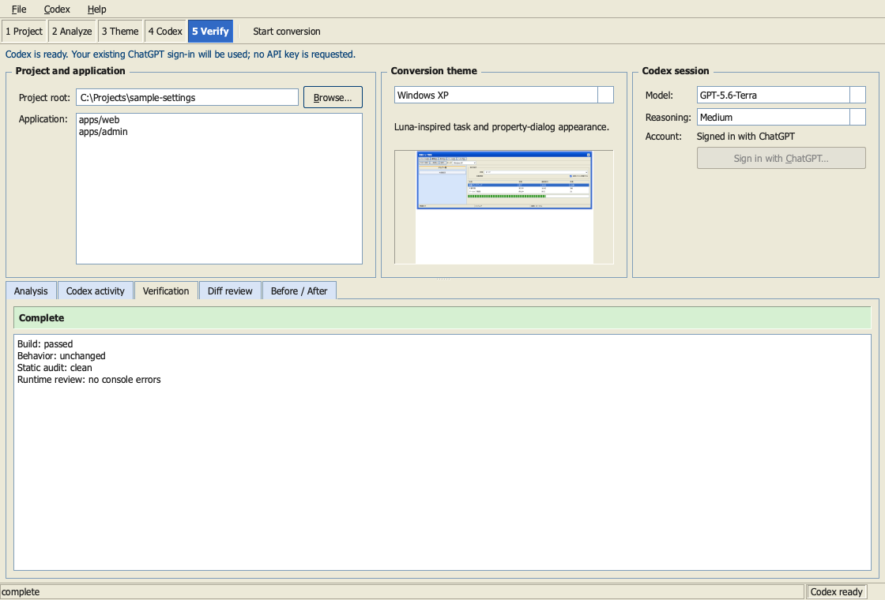
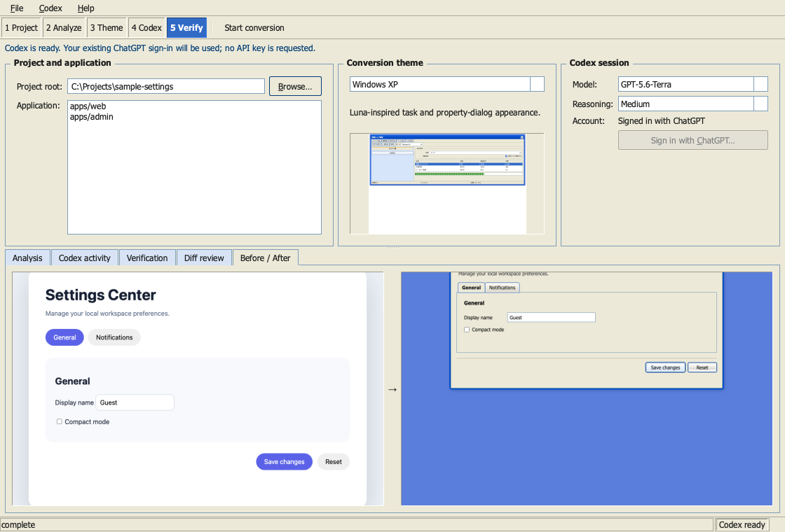
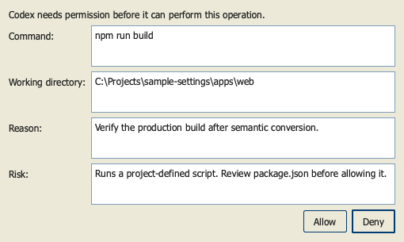
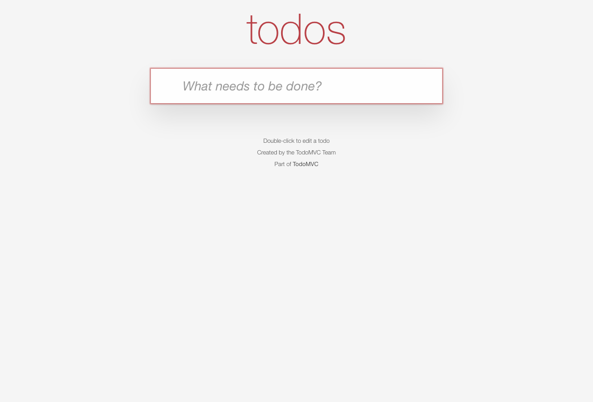
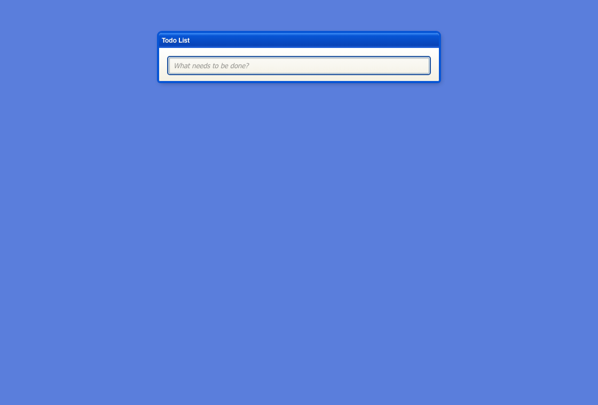

# Desktop GUI engineering report

Date: 2026-08-29
Status: v2.0.0 release candidate; publication remains gated by final exact-SHA CI

## Architecture

The desktop release uses PySide6/Qt Widgets with a Windows XP desktop-utility shell.
Qt preserves the canonical Python Core/CLI boundary, provides native menus,
group boxes, tabs, lists, dialogs, status bars, keyboard focus, accessibility
semantics, filesystem/process access, and a practical three-OS deployment
route. Tauri was the runner-up; its Rust/Python sidecar boundary would add more
distribution and protocol surface. Electron was rejected because the bundled
Chromium cost was not justified by this desktop-local workflow.

The application is split into:

```text
Qt widgets -> DesktopController -> ConversionWorkflow
                              |-> CoreFacade -> bundled CLI/Core
                              `-> CodexBridge -> codex app-server -> user's Codex
```

`CoreFacade` consumes the versioned CLI JSON contract. It does not reproduce
framework detection, monorepo selection, behavior signals, themes, audit, or
verification. `CodexBridge` contains JSONL/JSON-RPC, lifecycle, authentication,
models, threads/turns, streaming, approvals, user input, interruption, diff,
redaction, restart, and shutdown. The explicit Skill input points the turn at
the bundled `retro-web-ui/SKILL.md`; semantic edits remain Codex/Skill work.

## Codex integration

The implementation follows the current official [Codex App Server
documentation](https://developers.openai.com/codex/app-server/). It discovers
`codex`, starts `codex app-server` over local stdio, performs
`initialize`/`initialized`, reads `account/read` and effective `config/read`
without storing it, and populates only models and reasoning efforts advertised
by `model/list`. The local integration prototype
used Codex CLI `0.150.0-alpha.8`, the existing ChatGPT sign-in, and completed a
real streamed turn. No developer API key is requested or stored.

Each conversion creates a thread and starts a turn with the selected
application as `cwd`, `approvalPolicy=on-request`, and an
explicit `workspaceWrite` sandbox whose only writable root is the canonical
selected application; network is disabled.
Command, file-change, additional-permission, and tool user-input requests are
separate application events. Approval shows operation, cwd, reason, network or
filesystem scope, and risk; Deny is the default button. Interrupt waits for a
terminal event. Unexpected local App Server exit preserves edits, creates a
fresh transport on explicit reconnect, reinitializes authentication/models,
resumes and reads the durable thread, and rebuilds the Git diff for review/retry.

Protocol errors, stderr, event history, and GUI diagnostics redact credential,
authorization, login URL, device-code, API-key, and JWT-shaped values. Event
history is capped at 5,000 records. Compatibility is fail-closed through
executable discovery, successful initialization, account type, model discovery,
CLI schema/manifest checks, and method errors; optional experimental fields are
not assumed.

## GUI and accessibility

Windows XP was selected over Windows 98 because the workflow is naturally a
dense property/wizard utility: repository and app list, four-theme combo and
preview, Codex account/model/effort, analysis/activity/verification/diff/
Before-After tabs, result banner, and status bar. It uses compact spacing,
square controls, classic menu/toolbar hierarchy, group boxes, system-scale
typography, and no SaaS cards, pills, glass panels, or giant CTA.


Release-review captures also cover the terminal classification, the paired
visual evidence view, and the default-Deny approval dialog:

| Verification result | Before / After | Approval |
| --- | --- | --- |
|  |  |  |

Qt labels/accessibility names, mnemonic menu and Browse/ChatGPT controls,
keyboard traversal, visible status/error text, default-Deny approval, disabled
busy-state mutation controls, and screen-reader-compatible standard widgets are
retained. The GUI does not emulate historical accessibility defects.

## Failure-driven loop

| Failure | Layer | Generalized correction | Regression evidence |
| --- | --- | --- | --- |
| `runtimeWorkspaceRoots` was sent before experimental capability negotiation | Codex integration | use only current stable fields; gate optional fields | real initialize/thread/turn prototype |
| behavior signal change was classified as proven incompatibility | GUI workflow | conservative signal change means review; only incompatible schema or confirmed runtime regression means incompatibility | explicit classification tests |
| selected app was not an explicit turn-level write root | Codex integration/security | canonical app `cwd` plus `workspaceWrite.writableRoots`, network disabled | strict controller contract and real TodoMVC turn |
| `dev` server ran as a finite verification command and timed out after a successful conversion | GUI workflow | only finite build/test/lint/typecheck/check/verify purposes are executable plans; dev/serve/watch remain manual runtime hosts | TodoMVC post-failure replay: build only, Complete |
| npm cache had root-owned entries | platform/environment | use an isolated project-local temporary cache; never sudo or mutate user ownership | clean 64 MB TodoMVC install/build |
| optional GUI entry point imported Qt for `--version` | packaging | lazy Qt import and actionable missing-extra error | Qt-free clean wheel smoke |
| project could be changed while an agent turn was active | GUI safety | disable Browse/menu/app/theme/model/effort/start during the turn | widget/controller tests |
| App Server exit had no reconnect path | Codex integration | fresh transport, reinitialize, durable thread resume/read, rebuilt Git diff | fake transport crash/restart/read and controller recovery tests |
| Python 3.9 evaluated a PEP 604 union inside a runtime type alias | Platform/packaging | use `typing.Union` at the public minimum, not a CI-version exception | Python-minimum CI plus local modern Python suite |
| Windows test fixed a POSIX path literal for `config/read` | Platform/test | assert the host-native canonical path representation | Windows GUI matrix and macOS/Linux bridge tests |
| frozen GUI resolved the source-only CLI path through its own executable | Core/packaging boundary | installed/frozen mode invokes the canonical bundled CLI parser and handlers in-process; explicit source CLI paths retain process isolation | installed-route and explicit-process tests; native Core smoke |
| editable install and Python 3.14 produced non-reproducible Nuitka discovery | Packaging | require a regular wheel install on pinned CPython 3.12 and isolate all build/cache output | three-OS clean native jobs |
| macOS icon generation failed `iconutil` validation | Packaging/visual | generate original multi-size ICNS/ICO/PNG assets with pinned Pillow | macOS, Windows, Linux native builds |
| optional Qt imports were omitted from Linux frozen output | Packaging | explicitly include QtCore/QtGui/QtWidgets while retaining lazy source imports | Linux frozen startup smoke |
| Linux headless startup lacked `libEGL.so.1` | Platform | declare/install the desktop runtime prerequisite and report system dependencies separately from bundled Python/Qt | Linux native offscreen startup |
| native archives omitted Qt/PySide license documents | Packaging/security | stage GPL/LGPL and component licenses, source locations, notices, and a hashed per-platform inventory; fail builds when absent | archive unit test and three-OS native packaging gate |

The static settings fixture used the real App Server and Terra medium. It
changed only HTML/CSS/theme assets; JavaScript remained byte-identical. Browser
tab switching, form save/status, labels, console, behavior comparison, and audit
passed before/after.

The final v2.0.0 replay cloned that clean fixture into a new disposable target
and exercised the GUI controller with App Server client version 2.0.0. Terra
medium completed in 208.337 seconds without requesting an agent command. The
workflow classified `Complete`, changed only `index.html`, `styles.css`, and a
new `retro-windows-xp.css`, reported behavior `unchanged` with zero removed
protected signals, and returned a clean audit. `app.js` remained byte-identical
at SHA-256 `cb26d49fe19f5da5f929c892713ffe555decf4155abfed631bc9fc5a7c30a085`.
An independent browser replay switched General/Notifications and their `hidden`
states, changed the text and checkbox, submitted the form, observed
`Settings saved.`, and reported no console warning/error. The rendered surface
retained the compact XP title bar, tabs, group box, command row, and status bar.

The real OSS loop used pinned MIT TodoMVC
`ff43b02e59dfa604386bb382034b2cd07c2bcd8a` in a disposable sparse checkout.
The GUI selected `examples/javascript-es6`, ran a streamed App Server/Skill
conversion, displayed three approval events, built with webpack, and restricted
all writes to that app. After the long-running-command correction, the replay
produced: build exit 0, behavior `unchanged`, removed protected signals 0,
static audit `clean`, classification `Complete`, and the same generated
JavaScript SHA-256 as the original
(`01b56caf970328499b1ea12a405bd4c03e27bc4bad6d6e36d49884fe75159fac`).
The `#/active` route and theme root remained active with no browser errors.
Todo creation via Enter was already unreachable in the upstream baseline and is
not reported as a conversion pass.

| TodoMVC before | TodoMVC after (Windows XP) |
| --- | --- |
|  |  |

## Validation

- Python: 80 tests pass with PySide6; the same suite passes in the CLI-only
  environment with three Qt presentation tests intentionally skipped.
- App Server contracts: initialization, account/model, thread/start/read/resume and turn, string and
  integer request IDs, command/file/permission/user-input responses,
  interruption, diff, secret redaction, unexpected exit, restart.
- GUI state: project/app/theme/model, monorepo selection, approval allow/deny,
  busy locking, auth types, result classification, interruption/reconnect,
  verification failure, installed theme-preview fallback.
- Existing CLI/Core/Skill: all original tests remain, four themes validate,
  fixture builds pass, the repository Skill validator passes.
- Browser: showcase and React render smoke pass; React/MUI/Emotion,
  Vue/Bootstrap, SvelteKit hydration, and Next SSR/Radix browser/CDP interaction
  smokes pass after rebuilding all five fixtures.
- Packaging: two wheel/sdist builds are byte-identical. A network-isolated,
  dependency-free clean wheel install passes CLI, Core, manifest, static
  analysis, GUI package import, and GUI `--version`. Host-native archives bundle
  Python/Qt but not Codex, pass application/Core/Skill/App Server readiness
  smoke, and contain required license files plus component inventories.
- Visual: offscreen desktop render and real Chrome Before/After images were
  inspected for density, tabs, group boxes, controls, status, typography, and
  XP hierarchy. Browser console review was clean on both conversion targets.
  Browser captures use a fixed 1120 x 760 viewport: the static fixture came
  from its disposable local HTTP server; TodoMVC before and after came from
  clean and converted disposable worktrees (the final after-review origin was
  `http://127.0.0.1:8771`). Captures are evidence snapshots, not live previews.
- GitHub Actions: [CI run 33185574397](https://github.com/ririri-rgb/retro-web-ui/actions/runs/33185574397)
  passed Python 3.9 minimum, three-OS CLI reproducibility/clean install,
  three-OS optional GUI install/state/bridge tests, fixture builds, production
  dependency audit, browser runtime smokes, artifact upload, and diff hygiene.
  [Native run 33185574363](https://github.com/ririri-rgb/retro-web-ui/actions/runs/33185574363)
  independently compiled and launched Windows, macOS, and Linux packages after
  the generalized Qt/Linux fixes; the exact v2/license candidate is rerun before tagging.

## Security

The application delegates credentials to official Codex authentication and
does not save API keys, tokens, login URLs, device codes, or account identifiers.
Targets and app selections are canonicalized; symlink traversal and outside-root
selection are rejected. Git dirty state is visible, unrelated changes are never
reverted, baselines are external, subprocess commands use argv with
`shell=False`, target scripts require approval, and destructive or long-running
commands are not inferred as verification. No proprietary Windows assets are
used. Native archives expose bundled runtime files in a hashed inventory and
include project, Qt/PySide, CPython, OpenSSL, XZ, and mpdecimal notices; Codex
credentials and the Codex executable are not bundled.

## Performance and storage

On the local Apple Silicon validation host, offscreen application import,
construction, and first event processing took about 529 ms; observed maximum
resident memory was about 80 MB. App Server initialize took about 76 ms and
account plus model readiness about 81 ms with an existing login. The static
conversion took about 166 seconds. The larger TodoMVC agent turn took about 503
seconds before the first verification-policy failure; deterministic replay
after correction ran its build in under 6 seconds.

The CLI-only Python wheel remains under 100 KB without Qt. The local macOS arm64
native candidate ZIP was about 27.5 MiB and its expanded application about
77.7 MiB; release assets record exact per-OS sizes and hashes in native reports.
The disposable
TodoMVC checkout plus dependencies was about 70 MB and its isolated npm cache
about 12 MB. No browser, SDK, or system package was installed.

## Cross-platform and packaging

| Platform | Current evidence |
| --- | --- |
| macOS | CI host-native build/startup plus local native app launch with the user's real App Server; two conversions, Chrome runtime/visual, wheel/sdist; ad-hoc signed, not notarized |
| Windows | GitHub-hosted build, archive, GUI/Core/Skill/App Server readiness smoke, and optional GUI/state/bridge tests; unsigned and no physical-host UX test |
| Linux | GitHub-hosted build, archive, offscreen GUI/Core/Skill/App Server readiness smoke, and optional GUI/state/bridge tests; requires documented system desktop libraries and no physical-host UX test |

The optional Python wheel extra (`.[gui]`) remains available, so CLI-only users
do not receive Qt. Official release assets are host-native ZIP/tar archives
produced with pinned CPython 3.12, PySide6 6.11.2, and Nuitka 4.1.1. They are
portable application folders rather than an MSI/DMG/AppImage. Developer-ID
notarization, Authenticode, installer UI, and auto-update are explicitly outside
v2.0.0 rather than hidden completed evidence.

## Known limitations

GUI limitations:

- Native packages are archives, not MSI/DMG/AppImage installers. macOS is only
  ad-hoc signed and Windows is unsigned, so operating-system warnings are expected.
- The Before/After tab displays supplied capture evidence, but automatic target
  server discovery and screenshot capture are intentionally not inferred; real
  projects need an authorized runtime URL/command.
- Project analysis and initial App Server readiness are short synchronous
  operations; slow filesystems or a degraded Codex installation can briefly
  pause the window before event streaming begins.
- MCP elicitation and client-defined dynamic tool execution receive a
  correlated unsupported-method response and are surfaced for diagnosis; the implemented interactive surface covers
  conversion-relevant command, file, permission, and tool question events.
- Physical Windows/Linux desktop, signing/notarization, auto-update, and
  accessibility-technology certification remain unverified; CI evidence is
  host-native offscreen startup plus state/bridge contracts.

Skill limitations remain separate: static behavior hashes are review signals,
not semantic proof; dependency CSS, portals, hydration, virtualized UI, canvas,
closed Shadow DOM, and application-specific runtime behavior still require
target-aware Codex/browser review.

## Saturation and release recommendation

The two real conversions and heterogeneous existing fixtures no longer expose
new cross-cutting GUI/Core/App Server/Skill ownership failures. The last two
cross-cutting failures (write-root policy and long-running verification) were
fixed at their owning boundaries and covered by regression tests. Remaining
issues are bounded distribution/runtime-capture limitations or target-specific
semantic work rather than evidence that the architecture is in the wrong layer.

**Release recommendation: Ready for v2.0.0 exact-SHA release gates.** The new
end-user desktop product and App Server contract justify the major version.
Three-OS native startup, existing regression surfaces, real conversion evidence,
filesystem/approval boundaries, and packaging failures have converged without a
new cross-cutting architecture defect. Remaining gaps are disclosed platform UX,
signing/installer, automatic capture, or target-specific limitations. Publication
still requires the final versioned commit's normal CI, native matrix, secret and
archive scans, immutable tag creation, and public-download verification. Existing
tags remain unchanged.
